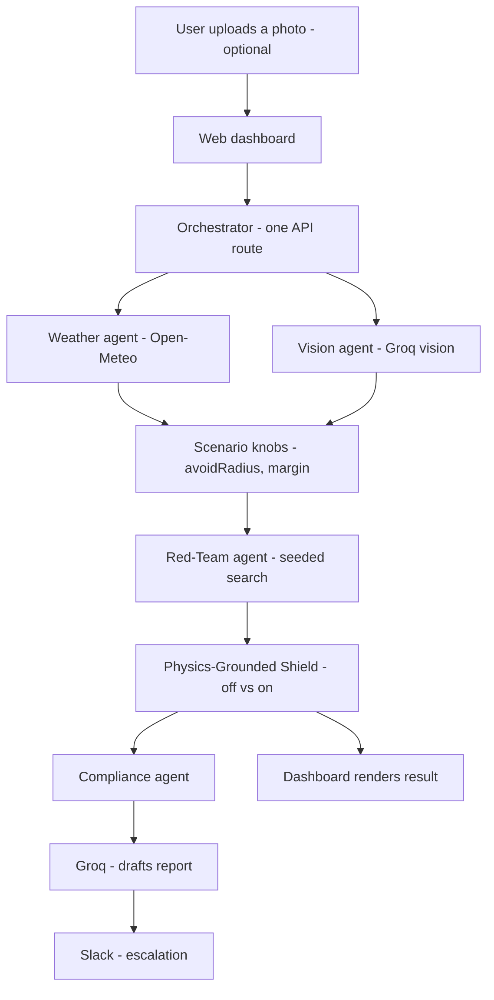

# Phronesis

Phronesis is a multi-agent continuous-assurance layer for physical AI — it tests, tries to break, and vetoes unsafe robot policies in real time, then escalates what it finds. The bottleneck in physical AI today isn't model capability, it's independent trust and safety validation, and nobody has built the continuous, cross-vendor version of that yet. A Red-Team agent adversarially searches for failure scenarios, a Physics-Grounded Shield overrides unsafe actions in real time independent of the policy, a Vision agent grounds scenario difficulty in a real photo you upload, and a Compliance agent drafts and escalates a live risk report.

**Live demo: [phronesis-khaki.vercel.app](https://phronesis-khaki.vercel.app)**

## Workflow



Each stage's output feeds the next, so the pipeline runs sequentially inside one serverless function per request.

## Agents

| Agent | What it does | External service |
|---|---|---|
| **Red-Team agent** | Adversarially samples seeded scenarios to find the one where the policy under test fails worst | — (pure computation) |
| **Physics-Grounded Shield** | Checks time-to-collision every step and overrides unsafe actions in real time, independent of the policy | — (pure computation) |
| **Vision agent** | Reads an uploaded photo of a real space and estimates a hazard density that grounds scenario difficulty | Groq (vision-capable LLM) |
| **Compliance agent** | Drafts a plain-English safety report from the run's results and escalates it | Groq (LLM) + Slack (webhook) |

Live weather (Open-Meteo, no key needed) grounds scenario difficulty the same way the Vision agent's photo analysis does — it feeds the same `avoidRadius`/`margin` knobs but isn't itself one of the four agents above.

## How to run

```bash
git clone https://github.com/PSKWak/phronesis.git
cd phronesis
npm install
npm run dev
```

Open http://localhost:3000. With no environment variables set, weather grounding is live (no key required) and the Vision/Compliance agents fall back to logging what they would have sent instead of failing.

## Project structure

```
phronesis/
├── src/
│   ├── app/
│   │   ├── api/run/route.ts    # orchestrator: runs every agent in sequence
│   │   ├── page.tsx            # dashboard UI
│   │   └── layout.tsx
│   ├── components/
│   │   └── SimCanvas.tsx       # renders hazards, goal, and trajectory playback
│   └── lib/
│       ├── physics.ts          # seeded point-robot simulation engine
│       ├── controller.ts       # the policy under test (reactive-only blind spot)
│       ├── shield.ts           # Physics-Grounded Shield (TTC override)
│       ├── redTeam.ts          # Red-Team agent (seeded adversarial search)
│       ├── weather.ts          # live weather grounding (Open-Meteo)
│       ├── vision.ts           # Vision agent (Groq image analysis)
│       ├── compliance.ts       # Compliance agent (Groq report + Slack)
│       └── simulate.ts         # runs one episode, shield on or off
├── package.json
└── README.md
```

## Reproducing a result

Every simulated run is a pure function of four numbers: `(rngSeed, nTrials, avoidRadius, margin)`. A fresh run mints a new `rngSeed` and pulls live weather (and an uploaded photo, if any) to derive `avoidRadius`/`margin`; the API response's `reproduce` field echoes back the exact recipe used. POSTing that recipe back to `/api/run` — the dashboard's "Reproduce this run" button, or "Replay" on any evidence-log row — skips the weather/vision calls and reproduces the identical worst-case seed, trajectories, costs, and override counts, bit-for-bit:

```bash
curl -X POST https://phronesis-khaki.vercel.app/api/run \
  -H "Content-Type: application/json" \
  -d '{"rngSeed": 553385, "nTrials": 40, "avoidRadius": 0.79, "margin": 0.268}'
```

This matters because an evidence-log entry that can't be replayed isn't useful as evidence. The only non-deterministic piece by nature is the Groq-drafted report wording (`temperature: 0` minimizes but can't fully eliminate this); the simulation facts it's drafted from are always identical on replay. `package-lock.json` pins exact dependency versions for reproducible installs.

## API / environment variable requirements

| Variable | Required? | Enables | Get one at |
|---|---|---|---|
| `Open-Meteo`| no key needed | Weather grounding (Open-Meteo) | always live |
| `GROQ_API_KEY` | optional | Vision agent + Compliance agent's LLM-drafted report | [console.groq.com](https://console.groq.com) → API Keys |
| `SLACK_WEBHOOK_URL` | optional | Compliance agent's Slack escalation | [api.slack.com/apps](https://api.slack.com/apps) → Incoming Webhooks |

Without `GROQ_API_KEY`/`SLACK_WEBHOOK_URL`, the pipeline never crashes — it falls back to a raw-text report and a server-side log line instead. Set both in the Vercel project's **Settings → Environment Variables** (Production scope) and redeploy (`vercel deploy --prod`, or push to `main` if Git integration is connected) for the running functions to pick them up.

## Deploy

```bash
vercel deploy --prod
```
