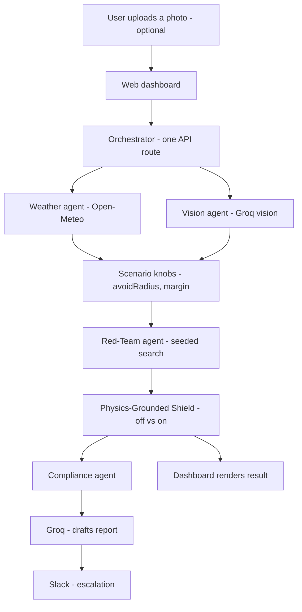

# Phronesis

**Live Website: [phronesis-khaki.vercel.app](https://phronesis-khaki.vercel.app)**


[2 Minutes Demo](https://drive.google.com/drive/u/0/folders/13EjpI_MHNnqvNhOev0C28iYzhltD4EDf)

---

## 01 — Project overview

**What we built:** Phronesis is a multi-agent continuous-assurance layer for physical AI — it tests, tries to break, and vetoes unsafe robot policies in real time, then escalates what it finds. A **Red-Team agent** adversarially searches seeded scenarios for a failure case. A **Physics-Grounded Shield** checks time-to-collision every step and overrides unsafe actions in real time, independent of the policy under test. A **Vision agent** grounds scenario difficulty in a real photo you upload. A **Compliance agent** drafts a plain-English risk report and escalates it. Every run is bit-for-bit reproducible from a four-number recipe, so a finding isn't just "it happened once" — it's independently re-verifiable.

**The problem it solves:** the bottleneck in physical AI right now isn't model capability, it's independent trust and safety validation — and nobody has built the continuous, cross-vendor version of that yet. Robot policies (foundation models, RL controllers, hand-written control code) get deployed near real hazards without any standardized, vendor-agnostic layer that adversarially tests them, catches failures at runtime regardless of what caused them, and produces an audit trail a safety team or regulator can actually use. Phronesis is infrastructure for that gap — closer to an observability/APM layer for robots than a competing robot policy itself.



| Agent | What it does | External service |
|---|---|---|
| **Red-Team agent** | Adversarially samples seeded scenarios to find the one where the policy under test fails worst | — (pure computation) |
| **Physics-Grounded Shield** | Checks time-to-collision every step and overrides unsafe actions in real time, independent of the policy | — (pure computation) |
| **Vision agent** | Reads an uploaded photo of a real space and estimates a hazard density that grounds scenario difficulty | Groq (vision-capable LLM) |
| **Compliance agent** | Drafts a plain-English safety report from the run's results and escalates it | Groq (LLM) + Slack (webhook) |

Live weather (Open-Meteo, no key needed) grounds scenario difficulty the same way the Vision agent's photo analysis does — it feeds the same `avoidRadius`/`margin` knobs but isn't itself one of the four agents above.

There are two parallel implementations of the simulation: a from-scratch **TypeScript** engine (`src/lib/`) that powers the live dashboard, and the original **Python/MuJoCo** reference build (`python/`, also runnable live via `/api/mujoco_run` — see below) using real `safety-gymnasium` physics. See [Setup instructions](#03--setup-instructions) for both.

## 02 — External apps used

The agents connect to three real external services, live, on every run — not mocked:

| Service | Used by | What for | Key required? |
|---|---|---|---|
| **Open-Meteo** | Weather grounding | Live wind speed + visibility tune scenario difficulty | No — always live |
| **Groq** | Vision agent + Compliance agent | Vision-capable LLM analyzes an uploaded photo for hazard density; a text LLM drafts the plain-English safety report | Yes — `GROQ_API_KEY` |
| **Slack** | Compliance agent | Posts the drafted report to a channel via an Incoming Webhook | Yes — `SLACK_WEBHOOK_URL` |

Groq is deliberately reused for both the Vision agent and the Compliance agent's report drafting — one key, two agents, no extra service to configure. Each integration degrades gracefully (falls back to a logged message instead of crashing) when its key isn't set, so the pipeline never breaks for missing credentials — see [`compliance.ts`](src/lib/compliance.ts), [`vision.ts`](src/lib/vision.ts), [`weather.ts`](src/lib/weather.ts).

## 03 — Setup instructions

### Run the web app locally

```bash
git clone https://github.com/PSKWak/phronesis.git
cd phronesis
npm install
npm run dev
```

Open http://localhost:3000. With no environment variables set, weather grounding is live (no key required) and the Vision/Compliance agents fall back to logging what they would have sent instead of failing.

### Environment variables

| Variable | Required? | Enables | Get one at |
|---|---|---|---|
| — | no key needed | Weather grounding (Open-Meteo) | always live |
| `GROQ_API_KEY` | optional | Vision agent + Compliance agent's LLM-drafted report | [console.groq.com](https://console.groq.com) → API Keys |
| `SLACK_WEBHOOK_URL` | optional | Compliance agent's Slack escalation | [api.slack.com/apps](https://api.slack.com/apps) → Incoming Webhooks |

Set both in the Vercel project's **Settings → Environment Variables** (Production scope) and redeploy (`vercel deploy --prod`, or push to `main` if Git integration is connected) for the running functions to pick them up.

### Deploy

```bash
vercel deploy --prod
```

### Run the real Python/MuJoCo prototype

The original reference implementation, run against real MuJoCo physics via `safety-gymnasium` rather than the TypeScript reimplementation:

```bash
cd python
python -m venv aegis-env
source aegis-env/Scripts/activate   # Windows: aegis-env\Scripts\activate
pip install -r requirements.txt
python main.py
```

See [`python/README.md`](python/README.md) for the Windows install gotchas (the package's own pinned dependency versions have no wheels for a current Python) and what each file does.

This same real Python/MuJoCo simulation also runs **live on Vercel** as a standalone serverless function — hit it directly:

```bash
curl "https://phronesis-khaki.vercel.app/api/mujoco_run?nTrials=6"
```

It executes genuine MuJoCo physics (not the TypeScript engine) on every request: real Red-Team search, real Shield override, a real Groq-drafted report. It's not wired into the dashboard UI yet — it's a separate, directly-callable endpoint. See [`api/mujoco_run.py`](api/mujoco_run.py).

### Project structure

```
phronesis/
├── src/
│   ├── app/
│   │   ├── api/run/route.ts    # orchestrator: runs every agent in sequence
│   │   ├── page.tsx            # dashboard UI
│   │   └── layout.tsx
│   ├── components/
│   │   └── SimCanvas.tsx       # renders hazards, goal, and trajectory playback
│   └── lib/
│       ├── physics.ts          # seeded point-robot simulation engine
│       ├── controller.ts       # the policy under test (reactive-only blind spot)
│       ├── shield.ts           # Physics-Grounded Shield (TTC override)
│       ├── redTeam.ts          # Red-Team agent (seeded adversarial search)
│       ├── weather.ts          # live weather grounding (Open-Meteo)
│       ├── vision.ts           # Vision agent (Groq image analysis)
│       ├── compliance.ts       # Compliance agent (Groq report + Slack)
│       └── simulate.ts         # runs one episode, shield on or off
├── api/
│   ├── mujoco_run.py           # real MuJoCo/safety-gymnasium simulation, live serverless function
│   ├── _controller.py, _shield.py, _weather.py, _compliance_agent.py, _patch_sg.py
│   └── _vendor/                # vendored safety_gymnasium + gymnasium_robotics source
├── python/                     # original MuJoCo/safety-gymnasium reference prototype (local use)
│   ├── main.py, controller.py, shield.py, red_team.py, weather.py, compliance_agent.py
│   ├── evidence_log.py, patch_sg.py, requirements.txt
│   └── README.md
├── requirements.txt             # Python deps for api/mujoco_run.py
├── vercel.json                  # maxDuration config for the Python function
├── package.json
└── README.md
```

## 04 — Reliability testing

This project was tested against the **live, deployed system**, not just locally — every fix below was found by actually driving the real app (browser automation, direct `curl` calls) and confirmed with real before/after numbers, not assumed from reading the code.

**Shield behavior, measured, not assumed.** The Shield's evasive maneuver was originally pure repulsion (steer straight away from a hazard), which could leave the robot oscillating near a hazard until it timed out without reaching the goal. This was caught by running 200 seeds and measuring the failure rate — 26/200 timeouts — not by inspection. The fix (steer tangentially, favoring whichever side keeps progress toward the goal) was verified the same way before shipping: timeouts dropped to 17/200, and total cost across the same 200 seeds dropped from 1047 to 764.

**Every external integration was tested with its failure path, not just its happy path.** Each of Open-Meteo, Groq, and Slack was deliberately exercised with its key/webhook missing to confirm the pipeline degrades to a logged fallback instead of crashing, and separately exercised live with real credentials to confirm genuine success. Along the way this surfaced and fixed real production bugs, each root-caused from the actual error response rather than guessed:
- A Groq `429` rate-limit error, traced to an unset `max_tokens` letting the model's default (2048) alone exceed the account's output-token-per-minute budget.
- A silently-truncated Vision response, traced to the model's `<think>` reasoning block eating the token budget before it could emit its answer — fixed with `reasoning_effort: "none"`.
- A Slack `messages_tab_disabled` and later `no_service` error, traced to the webhook initially targeting a DM instead of a channel, then to a miscopied webhook URL — both diagnosed from Slack's actual response body, which the code was changed to surface instead of swallowing.

**Reproducibility is itself a reliability mechanism.** Every run returns a `(rngSeed, nTrials, avoidRadius, margin)` recipe; POSTing it back reproduces the identical worst-case seed, trajectories, costs, and override counts, bit-for-bit (see the "Reproduce this run" / "Replay" controls, or the `curl` example below). This was verified directly: replaying a captured recipe was confirmed to return numerically identical results across repeated calls. An evidence-log entry that can't be replayed isn't useful as evidence, so this was treated as a correctness requirement, not a nice-to-have.

```bash
curl -X POST https://phronesis-khaki.vercel.app/api/run \
  -H "Content-Type: application/json" \
  -d '{"rngSeed": 553385, "nTrials": 40, "avoidRadius": 0.79, "margin": 0.268}'
```

**The Vercel Python deployment was verified against real platform constraints, not assumed to fit.** Before deploying `api/mujoco_run.py`, the actual installed dependency footprint was measured from a working local venv (~260MB) and checked against Vercel's documented 500MB Python function limit, rather than guessed. The deployment still failed twice on real, unanticipated platform errors — a dependency-resolution conflict from `uv`'s stricter resolver, and a `ModuleNotFoundError` from Vercel's Python runtime not adding a function's own directory to `sys.path` the way a normal script invocation would — both diagnosed from live Vercel build/runtime logs and fixed, then re-verified with live requests until they returned real, varying results (not cached or canned).

**Only non-Python and Python engines were cross-checked qualitatively**, not bit-for-bit, since they're intentionally different physics implementations (TypeScript custom point-mass kinematics vs. real MuJoCo). Both were confirmed to show the same qualitative pattern — a policy with a real, discoverable blind spot, and a shield that measurably reduces cost most of the time.

## 05 — Demo video

[Demo video — [placeholder, add link here](https://drive.google.com/drive/u/0/folders/13EjpI_MHNnqvNhOev0C28iYzhltD4EDf)](#)

*(Add a link to a walkthrough no longer than two minutes.)*
